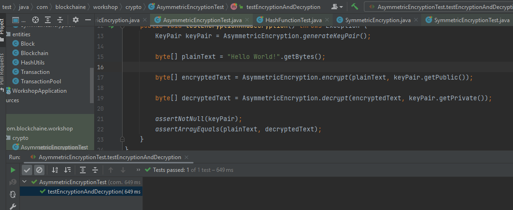

<h3>Blockchain Test</h3>

<h3>Symmetric Encryption Test</h3>

Use AES as an example

generate key and encrypt decrypted message passed successfully so our program is good, the decrypt with wrong key failed, that's logic cuz we already used the wrong key.

<h3>Asymmetric Encryption Test</h3>

Encrypted and decrypted the plainText test passed successfully, that means that the plainText equal the decryptedText.

